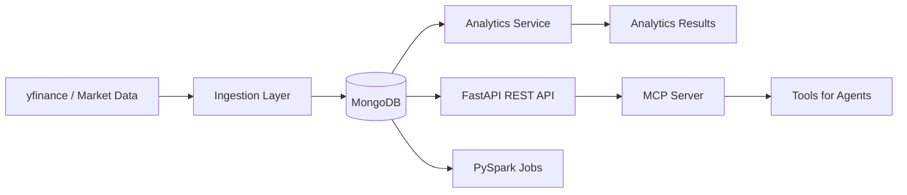
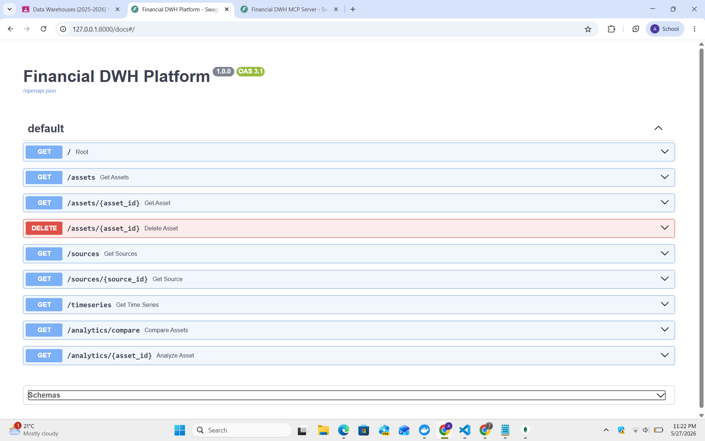
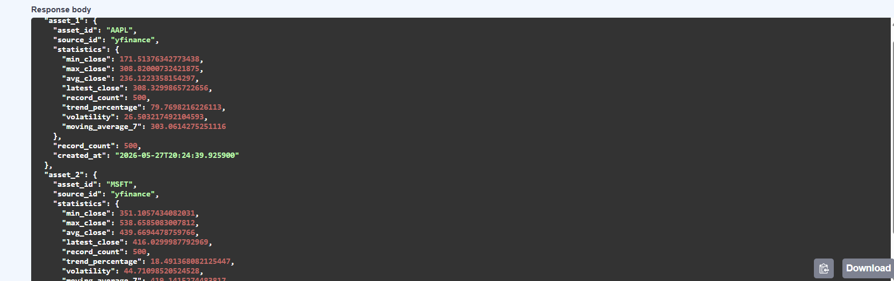
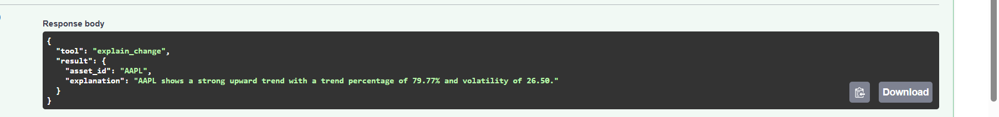

# Financial Data Warehouse Platform

Financial Data Warehouse Platform is a Python-based financial analytics project that combines FastAPI, MongoDB, PySpark, and an MCP server to ingest, store, query, and analyze market data with a temporal data warehouse approach.

## Overview

The platform ingests financial assets from Yahoo Finance through `yfinance`, stores historical records in MongoDB, exposes a REST API through FastAPI, runs lightweight Spark jobs for aggregation and prediction, and provides MCP tools for agent-style interactions.

## Stack

- Python
- FastAPI
- MongoDB
- PySpark
- Docker
- MCP server integration
- yfinance for market data ingestion

## Key Features

- Financial asset ingestion using `yfinance`
- MongoDB NoSQL storage
- Temporal data warehouse logic
- Append-only historical records
- Delete markers using `is_deleted`
- REST API with FastAPI
- Pagination and filtering
- Temporal querying with `as_of`
- Analytics for min/max/avg/trend/volatility/moving average
- Asset comparison
- Spark aggregation and prediction jobs
- MCP server with tool calling

## Architecture Overview



### Main Data Flow

1. Assets are ingested from `yfinance`.
2. Raw market records are written to MongoDB as append-only historical documents.
3. The REST API exposes filtered, paginated, and temporal queries.
4. The analytics service computes trend and risk metrics.
5. Spark jobs demonstrate aggregation and prediction logic.
6. The MCP server exposes reusable tools for AI/agent workflows.

## Temporal Warehouse Model

This project follows a simplified temporal warehouse approach:

- Historical records are never updated in place.
- New market snapshots are appended over time.
- Soft deletes are represented by delete markers with `is_deleted: true`.
- The `business_date` field represents the effective market date.
- The `system_date` field captures when the record entered the warehouse.
- Temporal queries can be executed with `as_of` to return records up to a specific date.

This design makes the platform suitable for historical analysis, auditability, and time-aware analytics.

## Project Structure

```text
financial-dwh-platform/
├── app/
│   ├── analytics/
│   ├── api/
│   ├── config.py
│   ├── dal/
│   ├── ingestion/
│   ├── mcp_server/
│   ├── test_analytics.py
│   ├── test_analytics_repository.py
│   ├── test_asset_repository.py
│   ├── test_connection.py
│   ├── test_data_source_repository.py
│   ├── test_prediction_repository.py
│   └── test_time_series_repository.py
├── spark_jobs/
│   ├── aggregation_job.py
│   └── prediction_job.py
├── docker-compose.yml
├── requirements.txt
├── README.md
└── .env
```

## Installation

### 1. Clone the repository

```bash
git clone https://github.com/aleilia08/financial-dwh-platform.git
cd financial-dwh-platform
```

### 2. Create and activate a virtual environment

```bash
python -m venv .venv
.\.venv\Scripts\activate
```

### 3. Install dependencies

```bash
pip install -r requirements.txt
```

### 4. Configure environment variables

Create or update the `.env` file in the project root if needed. A minimal local setup may include MongoDB connection settings used by the application.

Example:

```env
MONGODB_URI=mongodb://localhost:27017
MONGODB_DB=financial_dwh
```

## Run MongoDB with Docker

The project includes a Docker Compose file in the repository root.

```bash
docker compose up -d
```

This starts MongoDB locally and creates the persistent volume used by the platform.

To stop the container:

```bash
docker compose down
```

## Run Data Ingestion

The ingestion script loads sample assets, creates the data source entry, and downloads historical market data.

```bash
python -m app.ingestion.run_ingestion
```

What it does:

- creates the `yfinance` source in MongoDB
- inserts core assets such as `AAPL`, `MSFT`, and `BTC-USD`
- fetches daily historical prices
- stores append-only time series records with `business_date` and `values`

## Start the FastAPI API

Run the REST API with Uvicorn:

```bash
uvicorn app.api.main:app --reload
```

API base URL:

```text
http://127.0.0.1:8000
```

## Start the MCP Server

Run the MCP server with Uvicorn:

```bash
uvicorn app.mcp_server.server:app --reload --port 8001
```

The MCP server exposes callable tools through the `/tool/{tool_name}` endpoint.

## Run Spark Jobs

The repository contains two example PySpark jobs in `spark_jobs/`.

### Aggregation job

```bash
python spark_jobs/aggregation_job.py
```

This job demonstrates grouped aggregation over financial close prices.

### Prediction job

```bash
python spark_jobs/prediction_job.py
```

This job demonstrates a simple next-value prediction workflow.

> If you use a Spark distribution locally, you can also run these jobs with `spark-submit`.

## Example API Endpoints

### Assets

- `GET /assets?limit=10&offset=0`
- `GET /assets/{asset_id}`
- `DELETE /assets/{asset_id}`

### Data Sources

- `GET /sources`
- `GET /sources/{source_id}`

### Time Series

- `GET /timeseries?asset_id=AAPL&limit=50&offset=0`
- `GET /timeseries?asset_id=AAPL&limit=50&offset=0&as_of=2026-01-01`

### Analytics

- `GET /analytics/{asset_id}`
- `GET /analytics/compare?asset1=AAPL&asset2=MSFT`

### Example Responses

```json
{
  "asset_id": "AAPL",
  "statistics": {
    "min_close": 180.12,
    "max_close": 235.41,
    "avg_close": 207.84,
    "latest_close": 233.10,
    "record_count": 502,
    "trend_percentage": 29.47,
    "volatility": 4.18,
    "moving_average_7": 231.02
  }
}
```

## Example MCP Tools

The MCP server currently exposes the following tools:

- `list_assets`
- `summarize_trend`
- `compare_assets`
- `explain_change`

### Example tool calls

#### List assets

```json
{
  "tool": "list_assets",
  "result": []
}
```

#### Summarize trend

```json
{
  "tool": "summarize_trend",
  "result": {
    "asset_id": "AAPL",
    "statistics": {
      "trend_percentage": 12.4
    }
  }
}
```

#### Compare two assets

```json
{
  "tool": "compare_assets",
  "result": {
    "asset_1": {},
    "asset_2": {}
  }
}
```

#### Explain change

```json
{
  "tool": "explain_change",
  "result": {
    "asset_id": "AAPL",
    "explanation": "AAPL shows a moderate upward trend with a trend percentage of 12.40% and volatility of 4.18."
  }
}
```

## Screenshots

### API



### Analytics



### MCP



## Future Improvements

- Add authentication and authorization for API endpoints
- Replace demo Spark logic with production-grade batch pipelines
- Add orchestration for ingestion and job scheduling
- Introduce automated tests for all API and MCP routes
- Add data quality checks and schema validation
- Extend analytics with more indicators and benchmark comparisons
- Add dashboards and visualization layers
- Package the platform for containerized local development
- Add CI/CD for linting, testing, and deployment

## Notes

- The project is optimized for local development and academic demonstration.
- MongoDB is used as the persistence layer for historical and analytical records.
- The platform is designed to demonstrate temporal warehouse patterns and AI-friendly analytics tooling.
